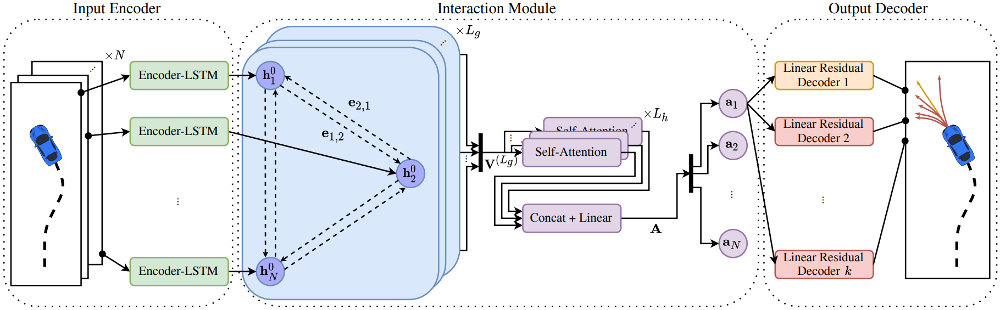

# CRAT-Pred: Vehicle Trajectory Prediction with Crystal Graph Convolutional Neural Networks and Multi-Head Self-Attention

Official repository of the paper:\
[CRAT-Pred: Vehicle Trajectory Prediction with Crystal Graph Convolutional Neural Networks and Multi-Head Self-Attention](https://arxiv.org/abs/2202.04488)\
Julian Schmidt, Julian Jordan, Franz Gritschneder and Klaus Dietmayer\
Accepted at 2022 IEEE International Conference on Robotics and Automation (ICRA)



## Citation
If you use our source code, please cite:
```bibtex
@InProceedings{schmidt2022cratpred,
  author={Julian Schmidt and Julian Jordan and Franz Gritschneder and Klaus Dietmayer},
  booktitle={2022 IEEE International Conference on Robotics and Automation (ICRA)}, 
  title={CRAT-Pred: Vehicle Trajectory Prediction with Crystal Graph Convolutional Neural Networks and Multi-Head Self-Attention}, 
  year={2022},
  pages={7799--7805},}
```

## License
<a rel="license" href="http://creativecommons.org/licenses/by-nc/4.0/">
</a><br />CRAT-Pred is licensed under <a rel="license" href="http://creativecommons.org/licenses/by-nc/4.0/"
 >Creative Commons Attribution-NonCommercial 4.0 International License</a>.
 
Check [LICENSE](LICENSE) for more information.

## Installation
### Install Anaconda
We recommend using Anaconda.
The installation is described on the following page:\
https://docs.anaconda.com/anaconda/install/linux/

### Install Required Packages
```sh
conda env create -f environment.yml
```

### Activate Environment
```sh
conda activate crat-pred
```

### Install Argoverse API
```sh
pip install git+https://github.com/argoai/argoverse-api.git
```

## Setup Argoverse Dataset
### Download and Extract Dataset
```sh
bash fetch_dataset.sh
```

### Preprocess the Dataset
Online and offline preprocessing is implemented. If you want to train your model offline on the preprocessed dataset, run:
```sh
python3 preprocess.py
```
You can also skip this step and run the preprocessing online during training.
## Train Model
```sh
python3 train.py
```
or
```sh
python3 train.py --use_preprocessed=True
```
Checkpoints are saved in the `lightning_logs/` folder.
For accessing metrics and losses via Tensorboard, first start the server:
```sh
tensorboard --logdir lightning_logs/
```
Navigating to http://localhost:6006/ opens Tensorboard.


## Test Model on Validation Set
```sh
python3 test.py --weight=/path/to/checkpoint.ckpt
```

## Generate Predictions on Test Set
```sh
python3 test.py --weight=/path/to/checkpoint.ckpt --split=test
```